+++
date = '2026-02-12T22:07:39-08:00'
draft = false
title = 'Setting up ADALM-Pluto SDR with RF-Swift'
+++

In this post I'm going to walk through setting up an ADALM-Pluto Software Defined Radio with RF-Swift (https://rfswift.io/) on an Ubuntu Virtual Machine. We will begin from setting up a new Virtual Machine as if you are a total or near total beginner.

Let's get to it:

1. Go to https://ubuntu.com/download/desktop and download the ISO. I'm choosing the Long Term Support (LTS) version as there's no compelling reason to go to the short-term variant.  
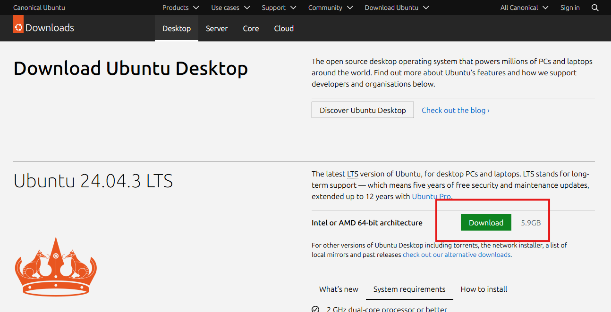

2. Verify the downloaded file hash. The Ubuntu website gives instructions for how to do this in linux. 
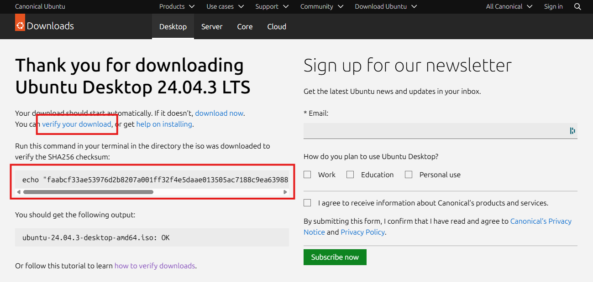

In this case, I'm on a Windows host, so we will need to do something slightly different. Open up a PowerShell window and you can type  `Get-FileHash [Path to ISO File]` to calculate the SHA-256 hash.

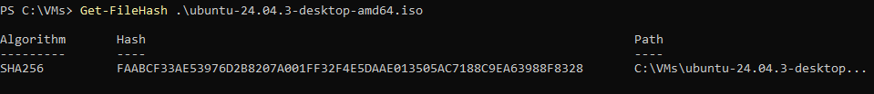

The file hash should match the one listed on the ubuntu website (shown in the second red box above after "echo").

Here is an easy PowerShell one-liner to compare the two file hashes (Replace the text in brackets as appropriate):

`Compare-Object (Get-FileHash [Path to ISO File]).Hash [Known good hash from webpage]`

A successful match will return nothing to the terminal, as seen below:

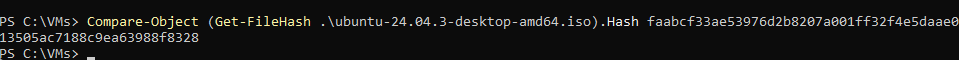

3. Now that we have verified the ISO file, let's setup a new VM. I'm using VMware Workstation 17 Pro. You can follow the new VM Wizard as seen below. I won't screenshot every step in the wizard as most are self-explanatory. I will be giving my VM a few more resources than normal; I recommend increasing the hard drive size to 80 GB because some of the RF-Swift images are quite large. I'm also giving mine 4 processors and 8 GB of memory. 

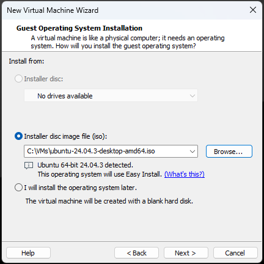

4. During the install, the Ubuntu installer may state that an update is available for the installer. Hit "Update now". 

If so, you will be prompted to close and re-launch the installer. Click the icon on your desktop to re-launch the installer. 

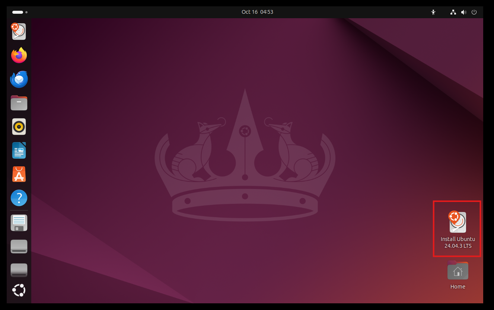

Continue through the install process, then log in with the password you set during install.

5. Once inside, open a terminal and run `sudo apt update` and then `sudo apt upgrade` to upgrade any software to the latest version.

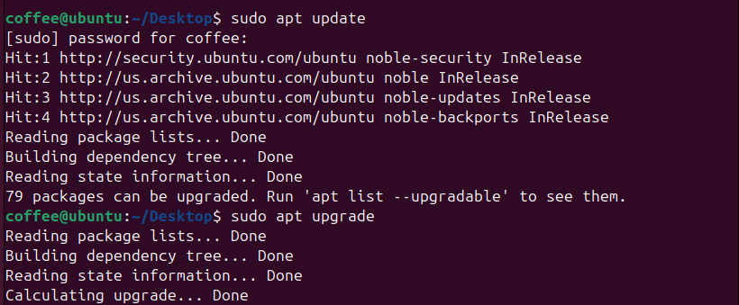

6. Download RF Swift and verify the installation.

Once updates are complete, open a browser and navigate to the current RF Swift repository at https://github.com/PentHertz/RF-Swift/releases. Download the appropriate version for your OS and architecture, in my case Linux x86_64. 

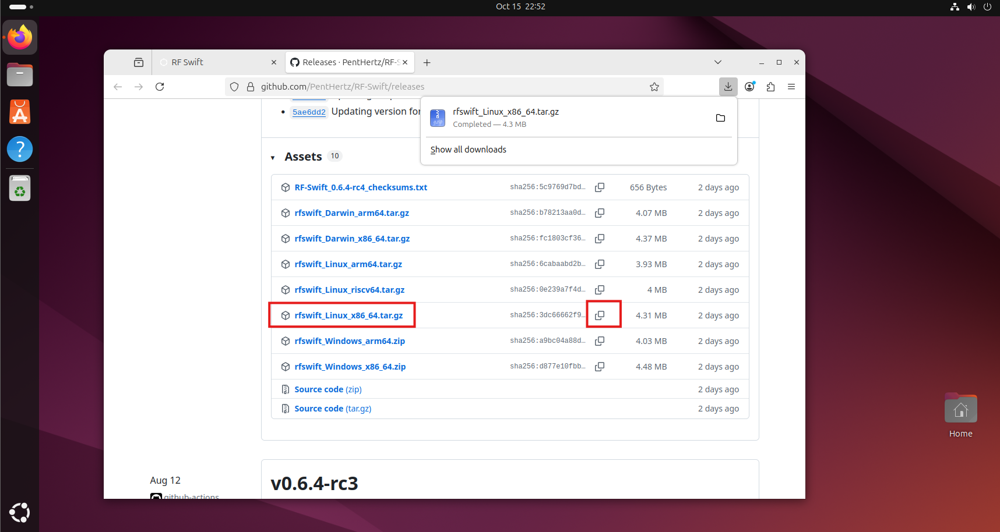

Note the file hash in the second column. Verify the file hash of the .gz file with: `echo "3dc66662f920c2acef7850986f66401a32d7a5b28c4a0867076b0f8c8e42b19e" rfswift_Linux_x86_64.tar.gz | sha256sum --check ` 

Substitute in the hash from the website, being sure to remove the leading "sha256:", and change the filename if you downloaded a different version). It should look something like this:

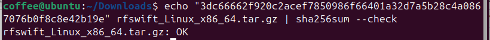

7. Install RF-Swift.

Unzip the archive with `gunzip rfswift_Linux_x86_64.tar.gz` and un-tar with `tar -xvf rfswift_Linux_x86_64.tar`.

Install with `./install.sh`.

RF-Swift will ask several questions, including prompting you to install docker, prompting for a system-wide or user-only installation, and ask for an alias. For this we selected a system-wide installation and an alias of rfswift:

8. Download an RF-Swift Image.

Now you can run RF-Swift with `rfswift`, and run `rfswift -h` to display the help menu. But before we can do anything, we need to download an RF-Swift image to be able to create a container. We can list available images with `rfswift images remote`. 

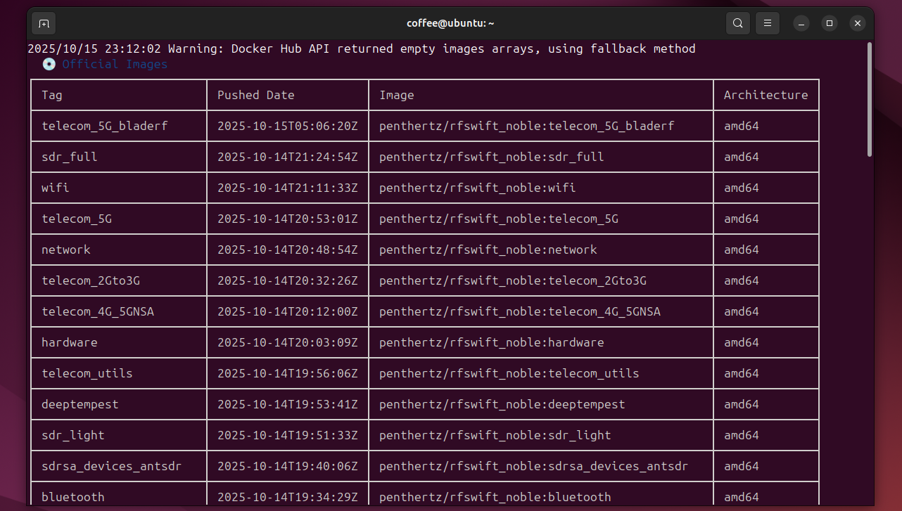

As you can see, there are a wealth of images. Each of these represents a docker container with a different collection of tools specialized for each specific task. Read more about how the images are organized here: https://rfswift.io/docs/guide/list-of-images

We want to use this container for a Software Defined Radio, so we are going to download the sdr_full image with `sudo rfswift images pull -i sdr_full`. (Running this command without sudo gave me a permissions error). Downloading the image may take some time.

I had two failed downloads, I believe because I ran out of disk space. Originally, I set this VM up with 40 GB of hard drive space, and at this point I had to go back and resize up to 80 GB. After that, it downloaded successfully.

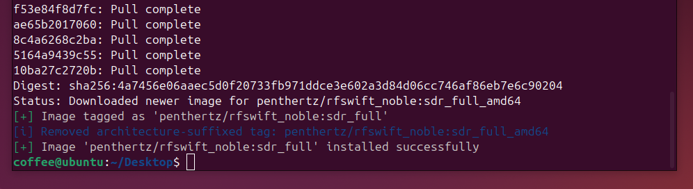

9. Create a new container.

In RF-Swift we create a new container with the "run" command. In this case I'm going to create a new container using the sdr_full image I just downloaded, and name it "sensor1".

`rfswift run -i sdr_full -n sensor1`

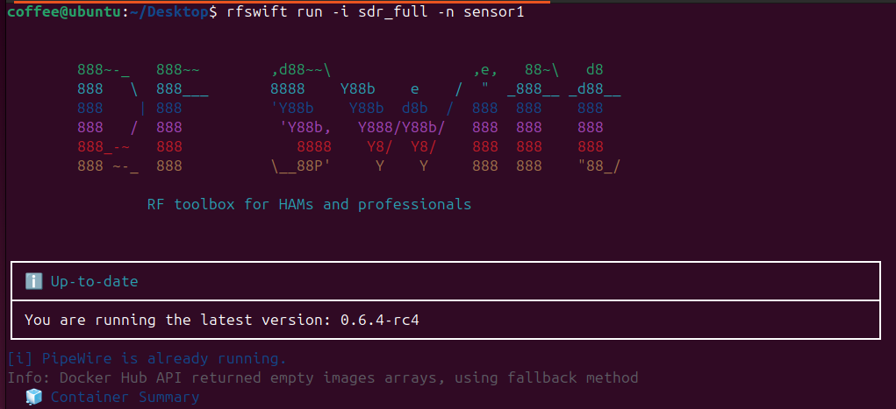

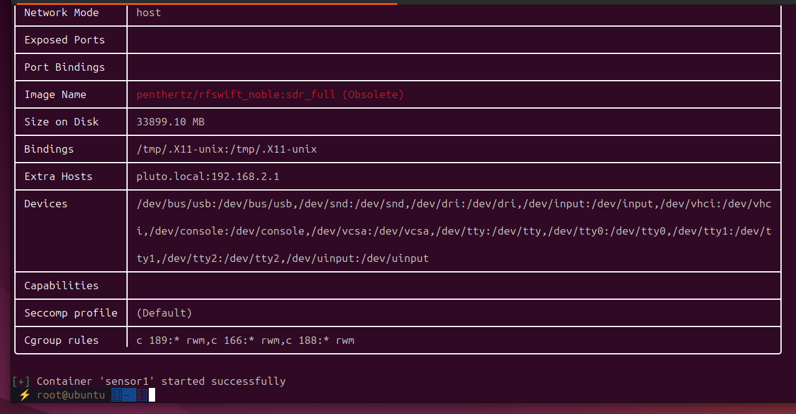

RF-Swift will create the container, then drop you inside it at a zsh terminal. RF-Swift will create the container, then drop you inside it at the zsh.

10. Connect the ADALM-Pluto.

Plug in the Adalm-Pluto's power and USB ports to a power source and your computer respectively. If running in a VM like I am, you will probably get a pop-up asking if you want to connect the USB device to the host or a VM, choose your VM.

Run `avahicontainer_start` in RF-Swift to initialize the Avahi service. A more detailed explanation of this script is located in the official RF-Swift docs here: https://rfswift.io/docs/container_scripts/avahi_inside_container/

Verify that RF-Swift can see the SDR with `iio_info -s`, which is part the libiio library created by Analog Devices. (https://wiki.analog.com/resources/tools-software/linux-software/libiio) You should see something like the following.

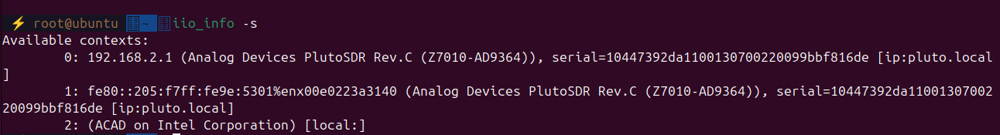

Contexts 0 and 1 both refer to the ADALM-Pluto, which can be addressed via IPv4 or IPv6, and is also available via DNS at pluto.local.

11. Open your SDR software. In this example, I'm going to use SDR++ to connect to the Pluto. Open SDR++ at the command line in RF-Swift with `sdrpp`. You should see something like the following.

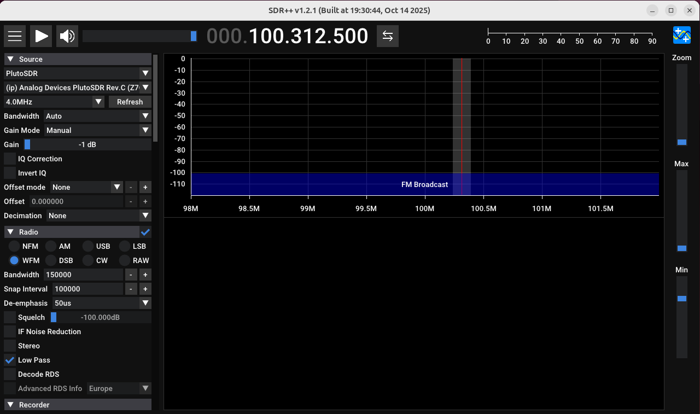

In the upper-left-hand corner, under "Source", click the dropdown menu and select "PlutoSDR". If the device is properly connected, you will see a name auto-populate in the next box down. 

Clicking the play button will display our radio spectrum analyzer chart and waterfall graph. 

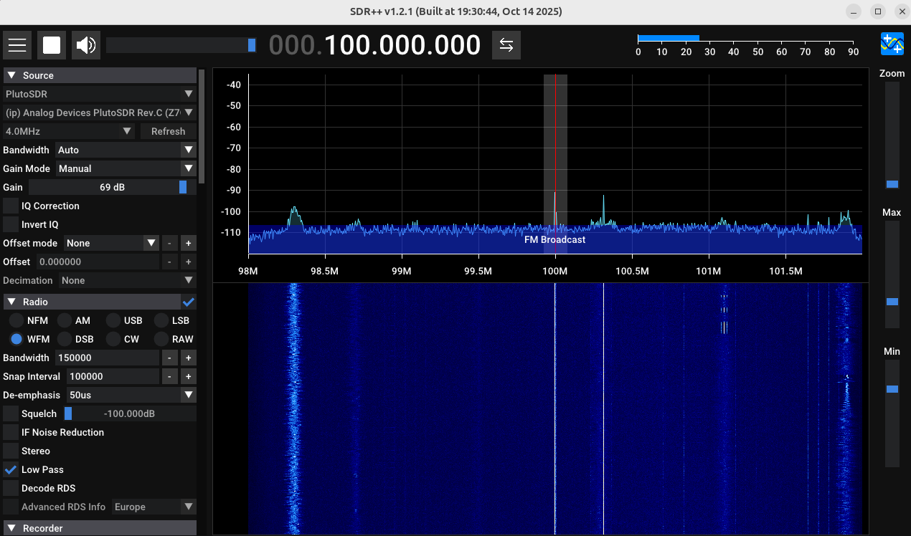

How to use SDR++ is beyond the scope of this article, but if you've made it this far, then congrats, you've successfully got RF-Swift and your ADALM-Pluto up and running.

However, there are a few more steps we need to do to get full functionality out of this radio. 

12. Manage PulseAudio/PipeWire for Container Sound.

From the [RF-Swift Documentation](https://rfswift.io/docs/guide/host-actions/):

	Many RF tools like GQRX, SDR++, and SDRAngel produce audio output that requires proper configuration to be heard on your host system. RF Swift provides commands to manage the PulseAudio/PipeWire server for this purpose.

Without this step, you will not be able to use gqrx in RF-Swift, or hear the audio from SDR++ on your host.

To do this, we need to perform the following steps.

1. Exit your container (`exit`), then at the host's command line update your package manager with `sudo apt update`.
2. Install Pulse Server with `sudo apt install pulseaudio` (The link above lists `sudo apt install pulse-server`, but in 2025 on Ubuntu that does nothing for me. Perhaps that was a deprecated command.)
3. Enable the module with `rfswift host audio enable`
4. Re-run your container with `rfswift last` (for the last container run) or `rfswift exec -c [container_name]` for any specific container.

You may also need to rerun the `avahi_container start` script after restarting the container.

If everything works, an easy test is tuning into a local FM radio station.

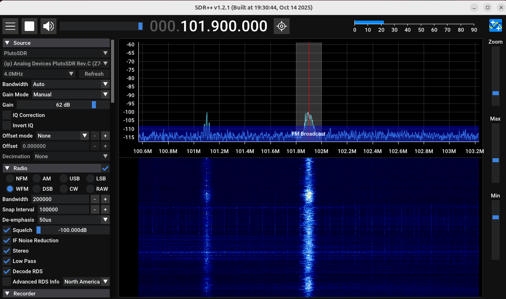
