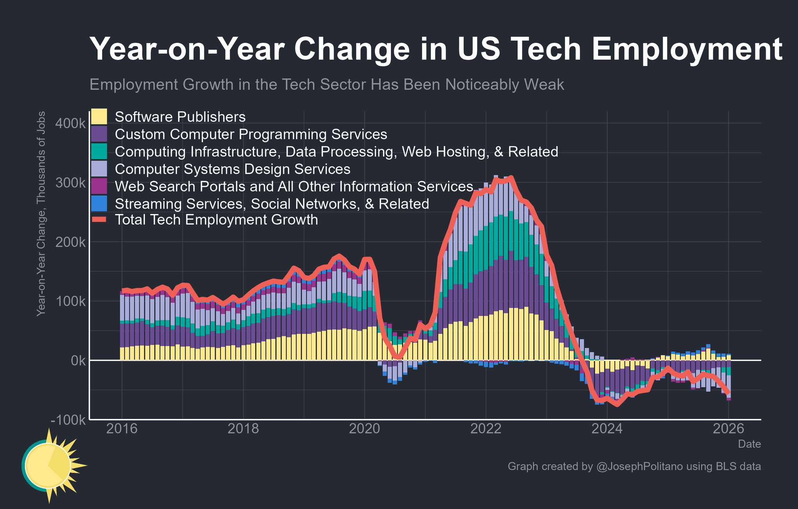

+++
date = '2026-07-06T08:48:30-07:00'
draft = false
title = 'Thoughts on AI'
+++

## 0. Edit:

I originally wrote this post in March 2026, but didn't get around to publishing it until several months later. Just wanted to add this as a comment about how I felt at the time in spring 2026.

## 1. The computer now speaks English

When I studied computer science as an undergrad, we did most of our work in Ada, a language notorious for its rigid structure. Recently when playing with Claude Skills, I was struck by the vast difference between programming in a strongly typed language like Ada and directing Claude by describing what I want the computer to do in a markdown file. It occurred to me that this is just one step closer to working with computers in natural human language. Over several decades we’ve gone from programming computers with punch cards to assembly to C to python, and today it's just one more step towards talking to the computer like it's another person. "Developers" will talk to the computer in YAML-formatted English so that "Users" can talk to the computer in regular English.

## 2. The fall of the Nerds

In a recent blog post [The Fall of the Nerds](https://open.substack.com/pub/noahpinion/p/the-fall-of-the-nerds), blogger Noah Smith states that AI is reducing the influence of a large number of people whose primary skills were being able to "think like computers." You may know these positions by their alternate job titles, which include “programmer”, “developer”, or “software engineer”, but fundamentally these roles are interpreters or linguists. In order to accomplish something with computers, a manager would have to use an interpreter (or a whole team of them) to whom they could speak to in English, and then the interpreter could direct the computer in a different language. Often this involved multiple layers of translators speaking increasingly complex versions of English before a single line of code would be produced: managers speaking to technical project managers speaking to engineers. The potential AI now holds is to compress this entire system and render broad swaths of it unnecessary.

Looking at these employment charts made by @JosephPolitano, you the significant relative reduction in the number of tech sector jobs. While some correction may have been likely after the work-from-home surge during covid, right now you see no sign of growth converging on the pre-covid trend. From what we can see in 2026 so far, the tech reduction seems to be accelerating, not returning to baseline.

## 3. The case of the missing secretary

In his blog post [[The case of the disappearing secretary]], Rowland Manthorpe discusses the case of the last big workforce automation, the introduction of the personal computer, which sheds some light on where we may be headed. It is shocking to hear that before the PC almost 20% of the workforce was secretaries, but apparently it is true. Manthorpe argues that the introduction of the PC led to everyone taking their own meeting minutes, drafting their own memorandums, etc. Inexpensive workplace computers made everyone into their own secretary. And similar to the interpreter situation above, there are of course still many secretaries and executive assistants in the workforce, but the relative rank an executive needs to warrant one has risen dramatically, and the relative number of secretaries much smaller. Manthorpe goes on to theorize that similar to above, AI will make us all managers, generally managers of teams of computerized agents.
 
This trend matches with what several friends have reported anecdotally. Two friends at magnificent 7 companies shared stories which match this trend. One shared with me how the role of software engineers is changing to be more like software engineering managers, in that software engineers are now writing less code directly and are instead managing their teams of agents. Of course, if software engineers are becoming software engineering managers, it raises the question of "what is happening to the software engineering managers?" Like the engineers themselves, their role is broadening also. Instead of worrying about finding, developing, and retaining engineering talent, these folks are being do greater coordination with other teams, clients, customers, etc.

The other friend manages security testing, and implements AI agents heavily in this process. In his experience, a pre-AI security test may be 3-weeks long, where the first few days involve coordination, set-up, kickoff, and the last week involves taking down any infrastructure, reporting, communicating findings and answering questions. In his experience, AI is removing the middle week of the testing, where the test team is focused entirely on the technical details of doing the work. AI agents are performing a lot of the individual tasks, but humans are still required to glue all of the individual components together.

A massive number of employees have been laid off, but of those who haven’t almost all are becoming broader; either by managing teams of agents or conducting greater coordination across the organization.

## 4. Do you use the computer to do your work, or is your work knowing how to operate the computer?

In the last six months, I've seen a number of arguments like: [The hidden Advantage of being over 50 in the age of AI](https://www.inc.com/joel-comm/the-hidden-advantage-of-being-over-50-in-the-age-of-ai/91312602). The basic argument is that judgment, experience, and "knowing what to build" is now much more important than "knowing how to build".

Sometimes these articles feel like a lot of cope, but I think there are all getting at something important. Let me give an example: A non-technical friend made her first iPhone application recently. This app will probably never be purchased by another person, her goal is not to start a business creating apps. Instead, this is something she wanted to use for herself, which didn't exist before. Her feeling is one of liberation - before she would have had to pay tens of thousands of dollars to a team of developers to create this app, now a $20 Claude Code subscription will do. Creating things with a computer is no longer gatekept behind a significant body of technical knowledge.

As a result, the people who are most postured to benefit from this transition are those who:
- Use the computer to do their work, as opposed to those whose work is knowing how to operate the computer
- Know what they want to build and why. 
- Speak the language of business and can give technical outputs sufficient context to make sense to different groups of humans (senior managers, customers, marketing, etc.).

## 5. Not so fast...

You might think based on the above that the best thing anyone employed in a technical field can do is get out immediately. However, just like in the case of the disappearing secretary above, there are good reasons to believe there are some breaks on this process. Consider the following paragraph from this [Forbes](https://www.forbes.com/sites/annatong/2026/03/05/cursor-goes-to-war-for-ai-coding-dominance/) article. 

>Cost remains an ever present challenge. Cursor’s larger rivals are willing to subsidize aggressively. According to a person familiar with the company’s internal analysis, Cursor estimated last year that a $200-per-month Claude Code subscription could use up to $2,000 in compute, suggesting significant subsidization by Anthropic. Today, that subsidization appears to be even more aggressive, with that $200 plan able to consume about $5,000 in compute, according to a different person who has seen analyses on the company’s compute spend patterns.

Just like many VC or PE backed enterprises, AI right now is a massive subsidized loss leader to gain market share. The idea that Anthropic is charging 1/25th the value of a Claude Code subscription is not just crazy, but also hints at their future business plans. Right now, these ultra-low prices are tempting companies to cancel that SaaS subscription and transition to "in house” development with Claude code, or cut back the size of the in house teams they already have. However, at some point, however, the AI providers will need to begin recouping their investment. Raising the price 25x to do that is not a ceiling but a floor. Once market share looks reliable the ideal price point is one that's just cheap enough to prevent companies from switching back to the old way of doing business. If Claude Code is truly capable of replacing entire teams of humans, then the eventual pricing model may look a lot more like Bloomberg Terminal than a Netflix subscription.

# 6. Conclusion

The computers now speak our native language, and the value of being able to talk to the computer in it's native language will continue to fall. This is unavoidable, but the rate at which this change takes place will be determined as much by what is maximally profitable as it will by when the technology is ready. The best way forward for anyone threatened by this career field compression is to focus on what you want to do with the computer, not just how to use the computer. For those who want to focus deeply on how the computer operates, that will still be an option, just know that the competition will be very intense until the career field reaches some sort of equilibrium again.
